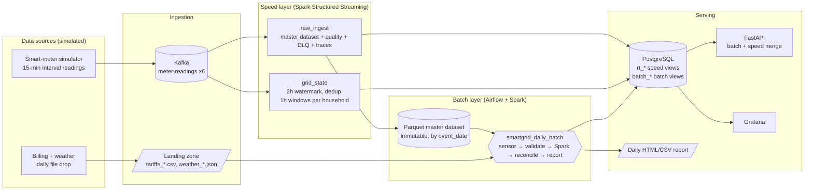

# SmartGrid: Lambda Architecture for Energy Monitoring & Billing

EC8203 Applied Big Data Engineering mini-project. This is an end-to-end **Lambda architecture**
data platform for **Use Case 3 - Smart Grid Energy Monitoring & Billing**.

> **Business question:** *What is the current grid load and renewable (solar) contribution by zone,
> and what will each household's bill look like once the daily tariff data is applied to its consumption?*

| | |
|---|---|
| Streaming source | Python smart-meter simulator → **Kafka** (`meter-readings`, 6 partitions, ~80 events/s) |
| Daily batch source | Python billing-system extract (tariff CSV) + weather JSON dropped once per simulated day |
| Speed layer | **Spark Structured Streaming**: event-time windows, watermark, dedup, threshold alerts |
| Batch layer | **Airflow**-orchestrated **Spark** batch job recomputing bills from an immutable **Parquet** master dataset |
| Serving layer | **PostgreSQL** + **FastAPI** (query-time merge of batch and speed views) + **Grafana** |
| Observability | JSON structured logs, **Prometheus** (+ Pushgateway), **Alertmanager** (14 rules), sampled event tracing |
| Simulated clock | **1 simulated day = 5 real minutes** (288× speed), starting 2026-03-01 00:00 UTC |

## Architecture



Full design rationale: **[docs/architecture.md](docs/architecture.md)** (Lambda vs Kappa decision,
trade-offs, rejected alternative), **[docs/tech_stack.md](docs/tech_stack.md)** (per-component
justification), **[docs/observability.md](docs/observability.md)** (logs, metrics, traces, alerts),
**[docs/data_model.md](docs/data_model.md)** (schemas, topics, tables), **[docs/demo_guide.md](docs/demo_guide.md)**
(script for the demo video).

## Quick start

**Prerequisites:** Docker Desktop with **≥ 8 GB memory** allocated to Docker, and about 8 GB of free disk.
Tested on Docker 28 / Compose v2.35 (Windows 11 + WSL2).

```bash
git clone https://github.com/TharushikaS/EC8203-MiniProject.git
cd EC8203-MiniProject
docker compose up -d --build        # first build ~10 min (downloads Spark, Airflow, Kafka images)
docker compose ps                   # all services "Up" / "healthy" after ~2 min
```

Then open:

| UI | URL | Login |
|---|---|---|
| Grafana dashboards | http://localhost:3000 | admin / admin |
| Serving API (OpenAPI docs) | http://localhost:8000/docs | - |
| Airflow | http://localhost:8080 | admin / admin |
| Spark UI (Structured Streaming tab) | http://localhost:4040 | - |
| Prometheus (alerts) | http://localhost:9090/alerts | - |
| Alertmanager | http://localhost:9093 | - |
| Kafka UI (optional: `docker compose --profile tools up -d kafka-ui`) | http://localhost:8085 | - |

### What happens after start-up (simulated clock)

| Real time after start | Simulated time | What you can see |
|---|---|---|
| ~1 min | 2026-03-01 ~05:00 | Live zone load / solar in Grafana *Live Grid Operations*, `/api/v1/realtime/zones` |
| ~5 min | 2026-03-02 00:00 | Day 1 complete; the tariff + weather files for 2026-03-01 land |
| ~6-8 min | 2026-03-02 ~05:00 | Airflow `smartgrid_daily_batch` bills 2026-03-01; report at `output/reports/2026-03-01/` |
| every 5 min after | +1 day | one more billed day, report and reconciliation |

Copy `.env.example` to `.env` to change the clock speed (`SIM_DAY_SECONDS`), the number of households,
fault-injection rates or thresholds.

### Verify end-to-end

```bash
python scripts/smoke_test.py --wait 900        # host-side, stdlib only; passes once the first day is billed
curl -s localhost:8000/api/v1/realtime/zones | python -m json.tool
curl -s localhost:8000/api/v1/households/HH-00001/bill-estimate | python -m json.tool
```

### Run the automated tests

```bash
docker compose --profile test run --rm tests   # 51 tests: billing rules, simulators, validation, Spark transforms
```

### Stop / reset

```bash
docker compose down          # stop (keeps data; the simulated clock keeps running from the anchor)
docker compose down -v       # full reset: deletes Kafka, lake, Postgres volumes and restarts the clock
```

> **Laptop sleep / long pauses:** the simulated clock follows real time, so if the machine sleeps for
> 8 hours the simulation jumps about 96 simulated days ahead, leaving a gap with no data. Before a demo,
> disable sleep, or run `docker compose down -v && docker compose up -d` about 15 minutes beforehand.

## Serving API

| Endpoint | Layer | Answers |
|---|---|---|
| `GET /api/v1/realtime/zones` | speed | current load kW, solar kW, renewable share, meter coverage per zone |
| `GET /api/v1/realtime/grid` | speed | grid totals and the lowest-renewable zone |
| `GET /api/v1/realtime/zones/{zone}/history` | speed | recent hourly windows |
| `GET /api/v1/alerts` | speed | LOW_RENEWABLE / ZONE_OVERLOAD threshold alerts |
| `GET /api/v1/households/{id}/bills` | batch | confirmed daily bills with the full price breakdown |
| `GET /api/v1/households/{id}/bill-estimate` | **batch + speed** | month-to-date: confirmed days (batch) + provisional today (speed × latest tariff) |
| `GET /api/v1/billing/{date}/zones` / `/households` / `/reconciliation` | batch | daily zone summary, all bills, speed-vs-batch drift |
| `GET /api/v1/reports/{date}` | batch | the consolidated daily HTML report |
| `GET /api/v1/pipeline/status`, `/pipeline/traces/{event_id}` | ops | batch runs, stream quality, latency, sampled traces |
| `GET /health`, `GET /metrics` | ops | freshness health check, Prometheus metrics |

## Demonstrating the Lambda properties

```bash
# 1. Late data: the speed layer drops readings older than its watermark, the batch layer recovers them
curl -s localhost:8000/api/v1/billing/2026-03-01/reconciliation | python -m json.tool

# 2. Recompute: the billing system re-issues a corrected tariff (+10%) for a past day ...
docker compose exec airflow-scheduler python /opt/smartgrid/scripts/issue_tariff_correction.py 2026-03-01 --pct 10
# ... and the batch layer regenerates that day's bills and report from the immutable raw archive
docker compose exec airflow-scheduler airflow dags trigger smartgrid_recompute \
  -c '{"start_date": "2026-03-01", "end_date": "2026-03-01", "reason": "tariff correction v2"}'

# 3. Failure detection: stop the meter feed and watch MeterStreamNoData / SpeedViewStale fire
docker compose stop meter-simulator   # then: http://localhost:9090/alerts ; restart with: docker compose start meter-simulator
```

## Repository layout

```
├── docker-compose.yml             # whole platform, one command
├── .env.example                   # every tunable (clock, population, fault rates, thresholds)
├── src/smartgrid/
│   ├── common/                    # config, simulated clock, households, energy model, billing rules, logging, db
│   ├── simulators/                # meter_stream.py (Kafka producer), daily_tariff_drop.py (daily files)
│   ├── speed/                     # streaming_job.py, transforms.py (shared with batch), sinks.py, metrics.py
│   ├── batch/                     # reference_loader.py, batch_billing.py (Spark), tasks.py, report.py
│   └── serving/                   # api.py (FastAPI), lambda_merge.py, repository.py
├── airflow/dags/                  # smartgrid_daily_batch.py, smartgrid_recompute.py
├── infra/                         # postgres schema, kafka topics, prometheus rules, alertmanager, grafana
├── docker/                        # Dockerfiles: spark (speed), airflow (batch), app (simulators + API)
├── scripts/                       # smoke test, tariff correction demo, dashboard generator
├── tests/                         # pytest suite (runs in the airflow image, includes Spark tests)
├── docs/                          # architecture, tech stack, observability, data model, demo guide
└── output/reports/                # generated daily reports (bind-mounted)
```

## Assumptions and simplifications

* **Simulated time**: 1 day = 300 real s (`SIM_DAY_SECONDS`). Meters report every 15 simulated minutes
  (about 3.1 real s). All timestamps are UTC. The clock anchor lives in `/data/state/sim_clock.json`.
* **Single-node everything**: one Kafka broker (replication factor 1), Spark in local mode, a shared
  Docker volume standing in for HDFS/S3. Production changes are listed in the report's limitations section.
* **Data**: 250 households in 5 grid zones (named after Sri Lankan cities). Tariffs in LKR use a
  block + time-of-use model. Cloud cover is deterministic per (day, zone), so the weather file and the
  meter solar output are consistent.
* **Faults are injected on purpose**: ~1 % duplicate sends, ~0.5 % invalid readings (5 kinds), meter
  outages that upload hours late, bad tariff rows, and late tariff files.
* The Spark batch job runs through `spark-submit --master local[2]` inside the Airflow scheduler
  container. Pointing `SPARK_MASTER` at a cluster is the only change needed to scale it out.
* Demo credentials (admin/admin, database passwords) are for local use only.

## Individual contributions

See [CONTRIBUTIONS.md](CONTRIBUTIONS.md).
