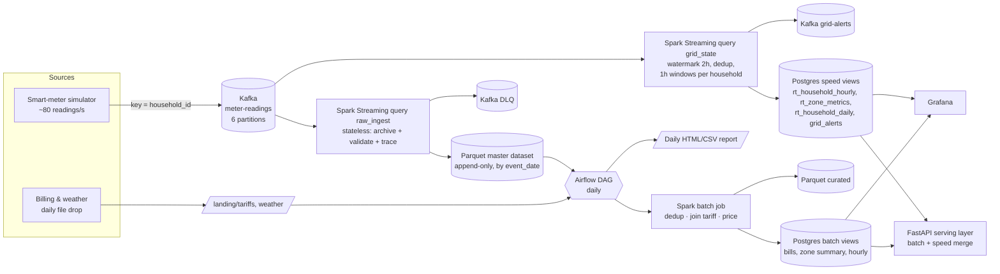

# Architecture decision: Lambda (and why not Kappa)

> Use case: **Smart Grid Energy Monitoring & Billing** (Use Case 3).
> Business question: *What is the current grid load and renewable contribution by zone, and what will
> each household's bill look like once the daily tariff data is applied to its consumption?*

## 1. Requirements we took from the use case

The business question has two halves, and they need different things from the platform.

| # | Requirement | Derived from | Latency | Correctness | Replay / audit |
|---|-------------|--------------|---------|-------------|----------------|
| R1 | Live grid load & solar contribution per zone | "current grid load … by zone" | seconds | approximate is fine (operational awareness) | no |
| R2 | Alert when renewable contribution is considerably low | suggested output | seconds | low false-positive rate | no |
| R3 | Per-household daily bill applying the daily tariff | "what will each household's bill look like" | hours (once per day, after the tariff lands) | **exact**: money, regulated, disputable | **yes**: must be reproducible and re-computable |
| R4 | Daily consolidated billing + solar-contribution report | suggested output | daily | exact | yes |
| R5 | Month-to-date "what will my bill be" for a customer | business question | seconds | final days exact, today provisional | - |
| R6 | Handle meter reality: duplicates (retries), invalid readings, **meters that go offline and upload hours late** | domain | - | late data must still be billed | - |
| R7 | Handle **tariff corrections**: the billing system re-issues a day's tariff | domain | - | bills must be regenerated | **yes** |

Two things stand out. The requirements have **two very different latency/correctness profiles**
(R1/R2 versus R3/R4). And the **authoritative output (money) depends on a dataset that arrives only
once per day** (the tariff), so there is nothing to bill in real time anyway.

## 2. The decision

**We chose a Lambda architecture:**

* **Batch layer** (source of truth): an append-only Parquet master dataset of every raw meter
  reading, plus a Spark batch job orchestrated by Airflow. The job recomputes the billing views
  from scratch for each simulated day once that day's tariff file has landed.
* **Speed layer** (low latency, approximate): Spark Structured Streaming over Kafka. It uses
  event-time windows and a watermark to keep live zone metrics, threshold alerts, and each
  household's running totals for today.
* **Serving layer**: PostgreSQL holds both views. A FastAPI service (plus Grafana) answers queries
  and **merges them at query time**: confirmed days come from the batch view, and days not yet
  billed are priced from the speed view (`serving/lambda_merge.py`).

## 3. Why Lambda fits this use case

### 3.1 Correctness of money must not depend on a watermark
A streaming aggregation has to decide at some point that a window is complete. In Spark this is
the watermark (2 simulated hours here), and anything that arrives later is dropped. Smart meters
really do lose connectivity and upload their buffer hours later (our simulator does this about 29
times per simulated day). For a **live dashboard** a small under-count for a few minutes is
acceptable. For a **bill** it is not. The batch layer reads the complete day from the master
dataset *after* a grace period, and it also picks up any later arrivals on a recompute. The platform
measures the difference directly. `speed_batch_reconciliation` stores the per-zone drift between
the two layers, and the batch job counts the **late readings it recovered**. This makes the
trade-off visible in the report, not just asserted.

### 3.2 The authoritative input is itself a daily batch
A bill can only be computed when the tariff file for that day exists. Tariffs change daily (a
fuel-cost adjustment), and the file can arrive late (our simulator delays it on about 15 % of
days). The billing view is therefore *naturally* a batch computation, triggered by data
availability. Airflow models exactly that: a sensor waits for the file, then validation, then the
Spark job, then the report. Pricing consumption continuously would not produce a final number any
sooner.

### 3.3 Recomputation is a first-class requirement (R7)
Billing systems issue corrections. Because the master dataset is append-only and the batch job is
a pure function of *(raw readings, reference data, code)*, a correction is handled by dropping in
`tariffs_<day>.v2.csv` and triggering the `smartgrid_recompute` DAG for that date range. The job
replaces the day's views in a single transaction. The same mechanism handles a bug fix in the
pricing rules, or a backfill after an outage. This is the property that justifies the batch
layer's existence.

### 3.4 Auditability
Every bill row carries `batch_run_id`, `tariff_version`, `reading_count`, `late_readings` and
`data_completeness`. Every day has a `batch_runs` lineage row (raw, invalid, duplicates removed,
late recovered). An auditor can reproduce any bill from the archived inputs.

### 3.5 Different consumers, different SLAs, isolated failures
Grid operators need second-level freshness. Customers and finance need exact daily numbers. With
Lambda the two paths fail independently. If the speed layer is down, bills are unaffected. If the
batch job fails, the live view keeps working and the API falls back to provisional speed figures,
clearly labelled `"source": "speed", "final": false`.

## 4. The rejected alternative: Kappa

In a Kappa architecture everything is a stream. There is one streaming code path, and
reprocessing happens by replaying the Kafka log through a new version of the job.

| Criterion | Kappa | Lambda (chosen) |
|---|---|---|
| Latency of live zone view | seconds | seconds (speed layer) |
| Billing correctness with late meter data | only if the watermark / allowed lateness covers the longest outage (hours) → large state, delayed results, or late updates to "final" bills | exact: batch reads the whole day after a grace period |
| Joining a once-a-day tariff file | the file must be turned into a stream / changelog and joined with state, and bills must wait for it anyway | natural: sensor → join |
| Tariff correction / rule change | replay the whole topic from the correction date; needs Kafka retention ≥ billing history (months), plus a parallel job and output swap | re-run the batch job for the affected days from Parquet |
| Storage for history | Kafka log (expensive per GB, retention-bound) | Parquet on disk / object storage (cheap, columnar, queryable) |
| Code bases | one | two, mitigated by a **shared transformation module** and one pricing function |
| Operational complexity | lower (one pipeline) | higher (stream + scheduler + batch) |

**Why Kappa loses here.** Kappa is the better choice when the business output is *itself* a
continuous stream: fraud scoring, or live vitals monitoring as in Use Case 2. In our case the
money-bearing output is a daily, correctable, auditable artefact. Kappa's single code path saves
work, but that saving costs either replay-based correction over months of retained Kafka data, or
bills that keep changing after they are issued. Both are worse for a regulated utility than
running a second, simple batch job.

**The cost we accept (honest trade-offs).**
* Two processing paths could drift apart. We mitigated this by putting parsing, validation and
  energy maths in `speed/transforms.py`, which both layers import, and by pricing with a single
  function, `common/billing.compute_bill`. The batch job calls it through `mapInPandas` and the API
  calls it directly. A unit test asserts that they give identical results.
* There are more moving parts to operate (Airflow + Spark batch + Spark streaming).
* The speed and batch views disagree for the current day, by design. The API labels every figure
  with its source, and the reconciliation table measures the gap.
* The raw archive is written from a `foreachBatch` sink, so it is at-least-once under a micro-batch
  replay. This is harmless because the batch layer deduplicates on `(meter_id, interval_start)`
  anyway, and the meters themselves already produce duplicates.

## 5. Consistency, latency, replay and cost

| Concern | Design choice |
|---|---|
| **Latency** | `grid_state` micro-batch every 10 real seconds (about 2-4 s processing on the demo laptop). Producer → speed layer p95 latency is exported as a Prometheus histogram. Batch views are available roughly one simulated hour after midnight (grace period) plus the job's runtime (about 1 min). |
| **Consistency** | Speed: effectively-once. Kafka offsets live in the Spark checkpoint and sinks are idempotent upserts keyed on (household, window), (zone, window) or (household, day). Batch: deterministic dedup on (meter_id, interval_start), and a staging-table swap in **one transaction** so readers never see a half-written day. |
| **Replay** | Speed layer: Kafka has 7-day retention, so the checkpoint can be reset. Batch layer: unlimited, from the Parquet master dataset (`smartgrid_recompute` DAG). |
| **Cost** | History lives in compressed columnar Parquet, not in Kafka. Streaming state is bounded by the watermark. One stateful query at household × hour grain, with SQL rollups, keeps CPU low. The batch job needs about 1 minute per simulated day. |

## 6. Simulated clock (time compression)

* **1 simulated day = 300 real seconds (5 minutes)**, so time runs 288× faster.
  This is configurable with `SIM_DAY_SECONDS`.
* The simulation starts on **2026-03-01 00:00 UTC** of simulated time (`SIM_START`).
* Meters report **15-minute intervals** of simulated time, which is about **3.1 real seconds**
  per interval.
* The anchor lives in `/data/state/sim_clock.json` on the shared volume. The first service to
  start creates it, and every other service reads it, so all components agree on simulated time.
* Consequences: the speed-layer watermark of 2 simulated hours is 25 real seconds. The daily DAG
  runs every 2 real minutes, which is about 10 simulated hours. The batch grace period is
  1 simulated hour (12.5 real seconds).

## 7. Layer-by-layer mapping

| Lambda component | Implementation | Code |
|---|---|---|
| Streaming source | Python smart-meter simulator → Kafka | `src/smartgrid/simulators/meter_stream.py` |
| Batch source | Python daily tariff and weather file drop | `src/smartgrid/simulators/daily_tariff_drop.py` |
| Master dataset | Spark streaming → Parquet (append-only, by `event_date`) | `speed/streaming_job.py` (query `raw_ingest`), `speed/sinks.py` |
| Speed layer | Spark Structured Streaming: windows, watermark, dedup, alerts | `speed/streaming_job.py` (query `grid_state`), `speed/sinks.py` |
| Batch layer | Airflow DAGs + Spark batch job | `airflow/dags/*`, `batch/batch_billing.py` |
| Serving layer | PostgreSQL + FastAPI (query-time merge) + Grafana | `serving/api.py`, `serving/lambda_merge.py` |
| Observability | JSON logs, Prometheus, Pushgateway, Alertmanager, Grafana | `common/logging_utils.py`, `speed/metrics.py`, `infra/*` |
