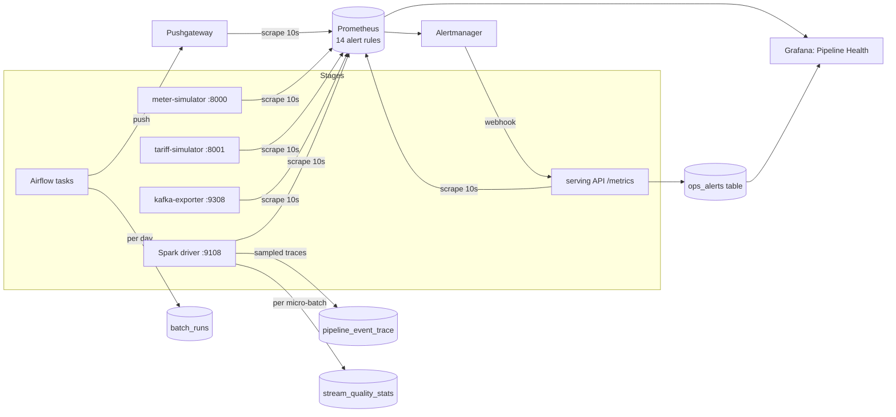

# Observability design

The goal is that **any failure in any stage is detected automatically and can be diagnosed
without guessing**. To get there we use the three pillars (structured logs, metrics, traces),
plus data-quality lineage, which matters most for a data pipeline.



## 1. Structured logging (all stages)

Every service writes **one JSON object per line** to stdout through `common/logging_utils.py`.

```json
{"ts":"2026-09-29T11:02:13.417+00:00","level":"WARNING","service":"meter-simulator","logger":"meter-simulator",
 "event":"meter_outage_started","stage":"ingestion","household_id":"HH-00123","grid_zone":"GALLE",
 "sim_time":"2026-03-02T14:15:00Z","outage_sim_hours":4}
```

| Stage | Service | Key events |
|---|---|---|
| ingestion | meter-simulator | `simulator_started`, `interval_batch_published` (hourly heartbeat with sent / duplicates / invalid / late counts), `meter_outage_started`, `meter_outage_recovered`, `kafka_delivery_failed` |
| ingestion | tariff-simulator | `daily_files_published`, `tariff_feed_delayed` |
| processing | spark-speed-layer | `stream_query_started`, `micro_batch_completed` (rows, duration, lag, watermark), `quality_batch_processed` (valid, invalid by reason, late), `grid_alert_raised`, `stream_query_failed` |
| storage | spark-speed-layer | `sink_write_failed` (table, batch_id) |
| ingestion / processing | batch-layer | `reference_data_loaded` (rows valid / rejected / carried forward, reject reasons), `batch_billing_started`, `batch_day_published`, `batch_billing_finished` |
| orchestration | batch-layer | `batch_target_resolved`, `waiting_for_tariff_feed`, `speed_batch_reconciled`, `airflow_task_failed`, `batch_metrics_pushed` |
| serving | serving-api | `api_started`, `request_failed`, `ops_alert_received` |

Useful commands:

```bash
docker compose logs -f meter-simulator | grep -i outage
docker compose logs spark-streaming | grep quality_batch_processed | tail -3
docker compose logs airflow | grep '"stage": "orchestration"'
```

## 2. Metrics (Prometheus)

| Stage | Metric | Type | Why |
|---|---|---|---|
| Ingestion | `smartgrid_producer_events_sent_total{kind}` | counter | throughput; `kind` = normal / duplicate / invalid / late |
| | `smartgrid_producer_delivery_errors_total` | counter | Kafka rejected writes |
| | `smartgrid_producer_faults_injected_total{fault}` | counter | ground truth to compare against what processing detected |
| | `smartgrid_producer_meters_offline` | gauge | meters currently buffering (future late data) |
| | `kafka_topic_partition_current_offset{partition}` | gauge | per-partition throughput, showing that keying spreads the load |
| | `smartgrid_tariff_last_drop_unixtime` | gauge | batch-feed freshness |
| Processing | `smartgrid_stream_input_rows_per_second{query}` / `processed_rows_per_second` | gauge | whether the speed layer keeps up |
| | `smartgrid_stream_kafka_lag_records{query}` | gauge | backlog (from `latestOffset − endOffset`, because Spark does not commit consumer-group offsets) |
| | `smartgrid_stream_batch_duration_ms{query}` | gauge | micro-batch health |
| | `smartgrid_stream_state_rows{query}` | gauge | state-store growth (watermark working?) |
| | `smartgrid_stream_records_total{status}`, `smartgrid_stream_invalid_records_total{reason}`, `smartgrid_stream_late_records_total` | counter | data quality |
| | `smartgrid_stream_e2e_latency_seconds` | histogram | producer → speed-layer latency (sampled) |
| Storage | `smartgrid_stream_sink_rows_total{table}`, `smartgrid_stream_sink_errors_total{table}` | counter | serving-store writes |
| Batch | `smartgrid_batch_last_status`, `…_last_success_unixtime`, `…_last_duration_seconds`, `…_last_raw_records`, `…_last_duplicates_removed`, `…_last_late_records`, `…_last_max_zone_drift_pct` | gauge (pushed) | batch-run outcome and quality |
| Serving | `smartgrid_api_requests_total{path,status}`, `smartgrid_api_request_seconds` | counter / histogram | API usage & latency |
| | `smartgrid_speed_view_age_seconds`, `smartgrid_batch_view_lag_days` | gauge | **freshness of each Lambda view** |
| Business | `smartgrid_zone_renewable_share{zone}`, `smartgrid_zone_load_kw{zone}` | gauge | business thresholds as metrics |

## 3. Alert and health-check rules

Defined in `infra/prometheus/alert_rules.yml`. Evaluation is every 10 s, and firing alerts go to
Alertmanager → API webhook → `ops_alerts`, shown on the Live Ops dashboard.

| Alert | Rule (summary) | Detects |
|---|---|---|
| `MeterStreamNoData` | producer rate == 0 for 1 min | **no data received in N minutes** (source down) |
| `SpeedLayerNoInput` | speed-layer input rate == 0 for 1 min | Kafka → Spark path broken |
| `ScrapeTargetDown` | `up == 0` for 1 min | a service crashed |
| `ProducerDeliveryErrors` | delivery-error rate > 0 | Kafka rejecting writes |
| `StreamingLagHigh` | lag > 5,000 records for 1 min | speed layer falling behind |
| `InvalidRecordRateHigh` | invalid / total > 5 % over 2 min | **error rate above threshold** (upstream data corruption) |
| `StreamSinkErrors` | sink errors increased | Postgres write failures |
| `SpeedViewStale` | speed view not updated for > 90 s | end-to-end freshness |
| `EndToEndLatencyHigh` | p95 latency > 60 s for 2 min | latency SLO (normal p95 ≈ 22 s, set by the 20 s `raw_ingest` trigger) |
| `TariffFeedLate` | no tariff file for > 2 simulated days | batch source missing |
| `BatchJobFailed` | last batch status == 0 | Airflow task failure (set by the failure callback) |
| `BatchViewStale` | latest bill > 2 simulated days old | batch layer not keeping up |
| `SpeedBatchDriftHigh` | zone drift > 10 % | how much late data the speed layer missed |
| `LowRenewableContribution` | zone share < 25 % during daylight | **business** threshold alert |

Separately, the speed layer raises **per-window business alerts** (`LOW_RENEWABLE`, `ZONE_OVERLOAD`)
into `grid_alerts` and the Kafka topic `grid-alerts`. The API `/health` endpoint returns
`ok` or `degraded` based on database reachability and on speed and batch view freshness.

## 4. Tracing

A full distributed-tracing stack (OpenTelemetry + Jaeger) is not justified for a pipeline with one
hop per stage, so we implemented **sampled event tracing with correlation IDs**:

* The `event_id` created by the producer is the trace id. It travels with the record through Kafka,
  the Parquet master dataset and the dedup logic.
* The speed layer's `raw_ingest` query samples about 1 % of valid events
  (`hash(event_id) % 100 < TRACE_SAMPLE_PCT`) and records the timestamp at each stage in
  `pipeline_event_trace`: `produced_at` → `kafka_ts` (log append) → `speed_processed_at` (archived
  and validated), together with partition, offset and micro-batch id. Late (outage) readings are
  flagged `is_late` and excluded from the latency histogram, because their delay is caused by the
  meter, not by the pipeline.
* `GET /api/v1/pipeline/traces/{event_id}` returns the stage timeline, and the latency histogram
  feeds the p50/p95 panels.
* Batch lineage: every bill row carries `batch_run_id` and `tariff_version`. Every Airflow run
  writes one `batch_runs` row per day (raw → invalid → duplicates → valid → late recovered). Every
  speed micro-batch writes a `stream_quality_stats` row.

## 5. Diagnosing a failure: worked examples

| Symptom | Where you look | What you see |
|---|---|---|
| Live dashboard frozen | Grafana *Pipeline Health* → `SpeedViewStale` firing | If `SpeedLayerNoInput` fires too, check the producer panel. Producer at 0 → `MeterStreamNoData` → `docker compose logs meter-simulator`. |
| Bills missing for a day | Airflow UI → `smartgrid_daily_batch` run | `wait_for_tariff_feed` still in *up_for_reschedule*, and `TariffFeedLate` firing → the feed is late, not a pipeline bug. |
| Numbers look low in real time | Billing dashboard → *Speed vs batch* panel | Drift % and "late readings recovered" show exactly how much late data the watermark dropped. |
| Spike in invalid data | *Invalid records by reason* panel + DLQ topic | The reason label (e.g. `future_timestamp`) pinpoints meter clock skew. The original payload is in `meter-readings-dlq`. |

Note on "no data" rules: when a scrape target is down, its series disappear rather than
dropping to 0, so `sum(rate(x[1m])) == 0` would never fire. The no-data rules use
`(sum(rate(x[1m])) or vector(0)) == 0` so that a missing source also counts as zero throughput.

## 6. Failure drills for the demo (verified)

Measured on the reference laptop: 4-core i7-10610U, Docker with 8 GB.

| Drill | Alerts that fired | Time to fire | Resolved after restart |
|---|---|---|---|
| `docker compose stop meter-simulator` | `SpeedLayerNoInput`, `SpeedViewStale`, `MeterStreamNoData`, `ScrapeTargetDown{job="meter-simulator"}` | 2-3 min (rate window + `for:`) | yes, within ~60 s, each delivered as `resolved` to `ops_alerts` |
| Cloudy (storm) simulated day | `LowRenewableContribution` (Prometheus) + `LOW_RENEWABLE` rows in `grid_alerts` / Kafka `grid-alerts` | within one 1-h window | when the sun sets or the sky clears |
| Recompute job running alongside the stream | `EndToEndLatencyHigh` (p95 ~65-100 s while both Spark apps share 4 cores) | ~2 min | yes, once the job finishes |

```bash
docker compose stop meter-simulator     # MeterStreamNoData, SpeedLayerNoInput, SpeedViewStale fire in ~2-3 min
docker compose start meter-simulator    # alerts resolve; Alertmanager sends "resolved"
docker compose stop spark-streaming     # ScrapeTargetDown(spark-speed-layer), SpeedViewStale; batch layer unaffected
docker compose start spark-streaming    # resumes from checkpoint, catches up on the Kafka backlog (lag panel)
```
